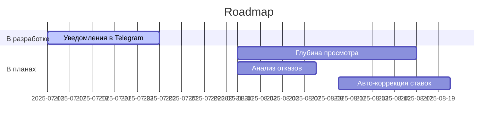

# Яндекс.Директ + PromoPult Analytics Dashboard

**Автор**: Irina Kozub  
**Лицензия**: [Pay-What-You-Want Shared License](LICENSE.md) (минимум $1 в TON для коммерческого использования)  

## 📌 О проекте
Автоматизированная система для аналитики рекламных кампаний в Яндекс.Директ через PromoPult. Собирает ключевые метрики в Google Sheets и готовит данные для визуализации.

**Текущий функционал**:

✅ Выгрузка данных из PromoPult:  
- Показы  
- Клики  
- Затраты  
- Внутренние взаимодействия  

✅ Интеграция с Яндекс.Метрикой:  
- Идентификаторы покупок  

✅ Автоматическое обновление:  
- Ежедневный сбор данных  
- Проверка дублирования  

## 🛠 Установка
1. **Клонируйте** этот репозиторий в Google Apps Script:
```javascript
function setup() {
  const scriptId = "ВАШ_SCRIPT_ID";
  const url = `https://script.google.com/macros/library/d/${scriptId}/1`;
  eval(UrlFetchApp.fetch(url).getContentText());
}
```

3. **Настройте** переменные в config.gs:
```javascript
const CONFIG = {
  PROMOPULT: {
    TOKEN: "ваш_api_ключ",
    PROJECT_ID: "ID_проекта"
  },
  METRIKA: {
    COUNTER_ID: "ID_счетчика",
    OAUTH_TOKEN: "токен"
  }
};
```

3. **Запустите** триггер:
```javascript
ScriptApp.newTrigger('analysAdvYandexDirect')
  .timeBased()
  .everyDays(1)
  .create();
  ```

🔮 **Планы развития**


💰 **Поддержка**
Если проект полезен для вашего бизнеса, поддержите разработку:
Toncoin (TON):
UQA_KkI02UIeLx8pOEtXcEcpKq0cZBgfDdB-wk1iWZ-WMbLg

📮 Контакты
Багрепорты: [issues](https://github.com/irinakozub/analysAdvYandexDirect/issues)
Коммерческие запросы: stf-2259@ya.ru

⚠️ Внимание: Проект активно развивается. API может меняться.
